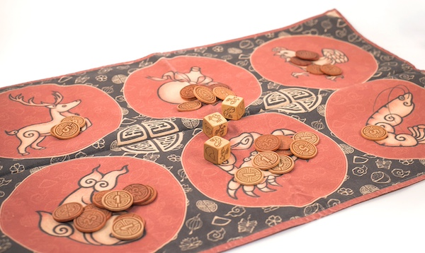

# Bầu Cua Tôm Cá: A Lunar New Year Game
This is a python-based version of a Vietnamese gambling game, [Bầu Cua Tôm Cá](https://en.wikipedia.org/wiki/Bầu_cua_cá_c%E1%BB%8Dp), that is played during Vietnamese Lunar New Year celebrations known as [Tết](https://en.wikipedia.org/wiki/Tết). This game can be run in your command line.

## Rules
The game is played with three six-sided dice and board or mat with six spaces. Each space on the board has one of six characters: gourd, crab, shrimp, fish, deer or rooster. On each di, each face also shows one of these characters. The objective of the game is to win money by betting on which space's character will be rolled by the dice.

The game is played in rounds for as long as players have money or want to keep playing. In each round the following steps take place:
1. Each player makes a bet by placing any amount of money on a space. More than one player can bet on a single space.
2. A dealer rolls all three dice together. The face-up side of each di determines the winning spaces for the round. If a space's character is not rolled, then that spaces loses the round.
3. The dealer collects money from losing spaces and pays the players that bet on winning spaces.
### Scoring
When a space wins, the amount that a player wins is equal to their bet plus their bet times the number of dice that match their space. If one di shows the winning space, then each player on the winning space gets to keep their bet and is payed 1x their bet amount by the dealer. The winnings are not divided among players; each player get paid based on how much they individually bet. If two dice show same winning space, then the winners get their money back and are paid 2x their bet amount by the dealer. If all three dice show the same winning space, then the winners keep their bet and are paid 3x their bet amount.

### Example
Four people, Minh, Vy, Long, and Phuong, play play a round of Bầu Cua Tôm Cá. Their bets are as follows:
* Minh bets 20.000 VND on shrimp.
* Vy and Long each bet 10.000 VND on deer.
* Phuong bets 50.000 VND on crab.

The dealer rolls three dice and the face-up sides show: `deer`, `crab`, `crab`. The results are as follows:
* Minh's space (shrimp) was not rolled so they lose their 20.000 VND.
* Vy and Long's space (deer) was rolled once. Vy keeps their 10.000 VND and are paid another 10.000 VND by the dealer for a total of 20.000 VND (bet + bet x 1 di). Long also keeps their 10.000 VND wager and is paid 10.000 VND by the dealer.
* Phuong's space (crab) is rolled twice. Phuong keeps their 50.000 VND wager and is paid 100.000 VND by the dealer for a total of 150.000 VND (bet + bet x 2 di).

### Specific To This Version
There are a couple caveats for playing this version of the game. After starting the script, the user will be prompt for the number of players (not including the dealer) and the type of currency being used. Next, each player will take turns entering their name and amount of money they're playing with. Afterward these initial steps, the game will process as normal with each player taking turns betting on a space and an amount of money. In normal games of Bầu Cua Tôm Cá, a player can bet on multiple spaces each round but in this version of the same a player can only bet on one space each round. After each round the user will be prompted as to whether or not they want to continue playing; enter YES to continue and NO to quit.
   
Thank for you playing! Chúc mừng năm mới!

## References
[wikipedia.org](https://en.wikipedia.org/wiki/Bầu_cua_cá_c%E1%BB%8Dp) 
[rgb.vn](https://rgb.vn/bau-cua-tom-ca-the-feast/)
